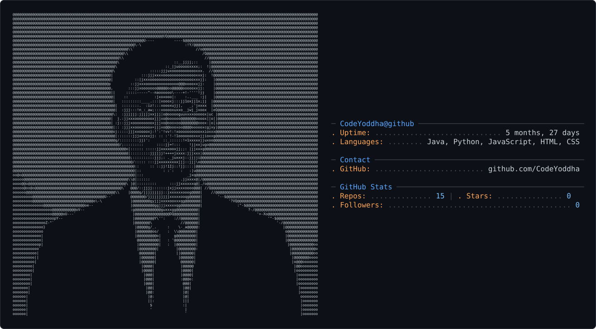

<!-- Animated Name Banner (kept from original) -->

<!-- Subtitle -->

 

<picture>
  <source media="(prefers-color-scheme: dark)" srcset="dark_mode.svg" />
  <source media="(prefers-color-scheme: light)" srcset="light_mode.svg" />
  
</picture>

---

## 👨‍💻 About Me

### Hi, I'm Milan

| ☕ Java | 🧩 DSA | 🎯 LeetCode |
|:---:|:---:|:---:|
| OOP, Collections, Streams | Trees, Graphs, DP, Recursion | Daily problem practice |

---

## 🧠 What I'm Grinding

| Topic | Progress |
|---|---|
| ☕ Core Java | ████████░░ 80% |
| 🌲 Trees & Graphs | ██████░░░░ 60% |
| 🔗 Linked Lists | ████████░░ 80% |
| 🧩 Dynamic Programming | █████░░░░░ 50% |
| 🎯 LeetCode Problems | ██████░░░░ 60% |

---

## 🛠️ Tech Stack & Skills

---

## 🚀 Goals

- ☕ **Master Java** — deep dive into core concepts, collections, and best practices
- 🧩 **Strengthen DSA** — build strong fundamentals in data structures and algorithms
- 🎯 **Consistent Practice** — solve problems daily on LeetCode / GFG
- 🏆 **Google Summer of Code** — contribute to open source with strong fundamentals

---

## 📊 GitHub Stats

---

## 🔥 Contribution Streak

---

## 📈 Activity Graph

---

## 🤝 Connect With Me

---

*"Code is poetry, and I'm just learning the alphabet."* 🚀

